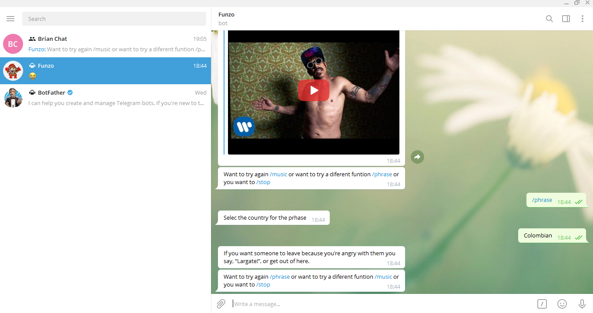
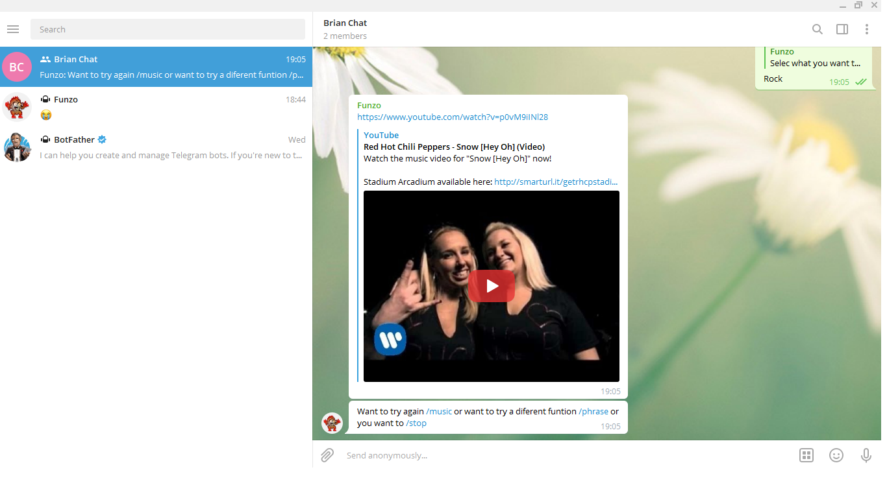

# Funzo BOT

This project consists on made a Telegram BOT. This specific BOT gives you random music or a random phrase.

## Built With :

- [Ruby ](https://www.ruby-lang.org/en/)
- [GitHub](https://github.com/)
- [RSpec](https://rspec.info/)
- [Telegram ](https://telegram.org/)
- [telegram-bot-ruby](https://github.com/atipugin/telegram-bot-ruby)
- [linters](https://github.com/microverseinc/linters-config/tree/master/ruby)

## Issue page link

[Issue link](https://github.com/BrianSammit/Ruby_capstone/issues)

## 🎥 PRESENTATION VIDEO

[Link Presentation Video](https://www.loom.com/share/c1caa8e308eb4d0a8a37feb8bedf2f80)

## 🔧 Getting Started

> To get a local copy and running, follow these simple steps.

- Go to the main page of the repo.
- Press the "Code" button and get the repo link.
- Clone it using git clone.

### 📝 Prerequisites

- Ruby -v2.7.0p0

### 📝 Setup

- Open a terminal
- Copy this code :
  `git clone https://github.com/BrianSammit/Ruby_capstone.git`
- Run the program with this code :
  `bundle install`
- Run the program with this code :
  `bin/main.rb`
- Stop the program with: "Ctrl + C" (Windows or Linux) or "Command + C"(Apple)

### 📝 How to interact with the bot?

- When the program is running go to your page of telegram

- Search for: @Funzo_bot

- Click on Start

- Follow the instructions

### Usage

- Personal Project - Create a Telegram-bot to run basic concepts of Ruby language just for learning propose.

## How to run the RSpec test

- You need to have the RSpec installed on your computer. If you don't have it follow the steps.

Boot up your terminal and write the followring command `gem install rspec` to install RSpec. Once that’s done, you can verify your version of RSpec with `rspec --version`, which will output the current version of each of the packaged gems. Take a minute also to hit `rspec --help` and look through the various options available.

- cd into the project and open a terminal.
- In the terminal just write `rspec` to run the tests.

## Authors

👤 **Brian Sammit Cruz Rodriguez**

- Github: [@BrianSammit](https://github.com/BrianSammit)
- Twitter: [@CruzSammit](https://twitter.com/CruzSammit)
- Linkedin: [Brian Sammit](https://www.linkedin.com/in/brian-sammit-cruz-rodriguez-5877551a8/)

## 🤝 Contributing

Contributions, issues and feature requests are welcome!
Feel free to check the issues page.

## Show your support ⭐️

Give a ⭐️ if you like this project!

## 📝 License

This project is MIT licensed.
